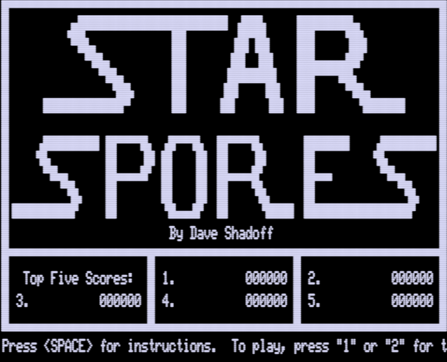
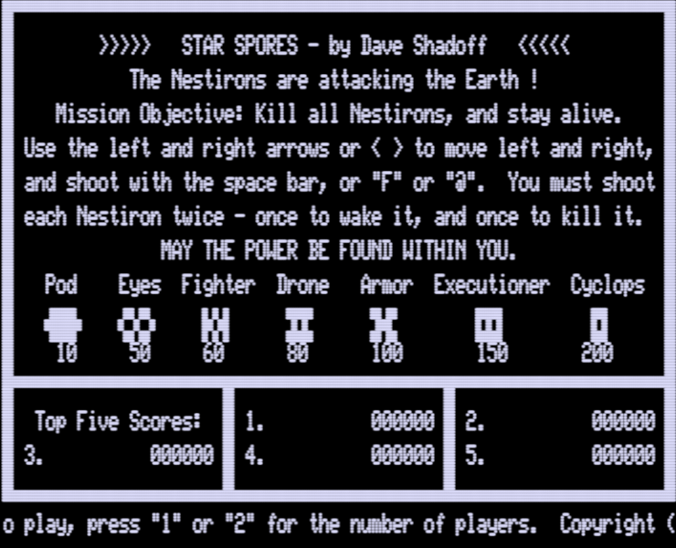
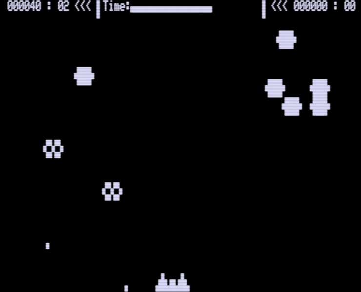

# Star-Spores_TRS-80_Mod1
Repository of information from development of Star Spores assembly-language game for the TRS-80 Model I computer in 1982

## Background

In 1980, I got my first computer and within about 2 months, I felt I had
outgrown BASIC and moved on to assembler, and loved the speed that it
provided.

I also really enjoyed the videogames in the burgeoning arcade industry,
stepping into an arcade every chance I was near one, just to check out
the new games, and spend a few quarters (I didn't have enough money or
time to get very good at the games).

Meanwhile, some of the arcade feel was made available to the TRS-80
by Big Five Software and their line of games, which was excellent and
an inspiration to people like myself - to know that the machine was ever
capable of this !

## Original Tools

Star Spores was programmed over the summer of 1982, and although I
solicited several publishers to market the game, it wasn't ultimately
licensed.

The game was written in Z-80 assembler on a TRS-80 Model I computer with
Level II Basic and a tape drive (but no disk drive).  I had a 48K upgrade
in the computer.

Radio Shack's "EDTASM" Editor/Assembler was used to manage and
assemble the source.  Some data was also prepared by hand, and entered
using TBUG (included with Disk EDTASM), and/or possibly ZBUG (published
in the January 1981 issue of 80 Microcomputing).

For informaiton on how to recompile the source, please read the
[Build_notes.md](Build_notes.md) file in this repository.

## Organization

Sources and re-compilation information can be found in the 'src/' subdirectory, and
miscellaneous other development notes can be found in the 'notes/' subdirectory.
Compiled output is in a 'release/' subdirectory.

## Screenshots

### Title Screen:

### Instruction Screen:

### Game Play

